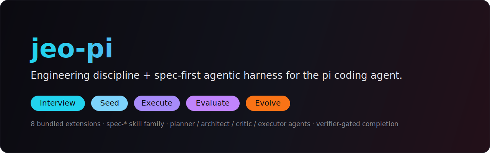
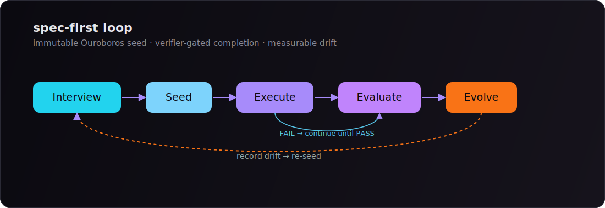
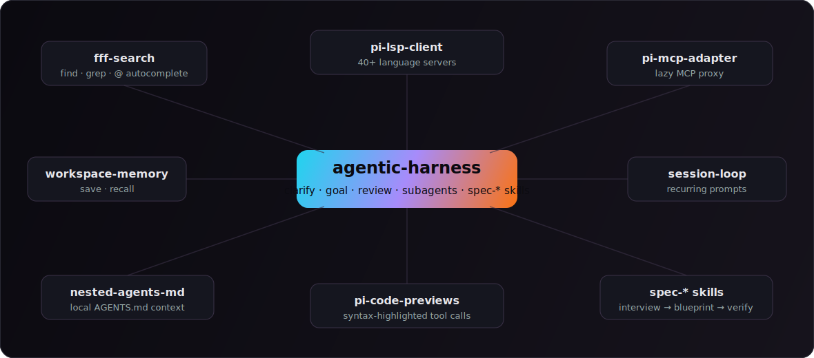
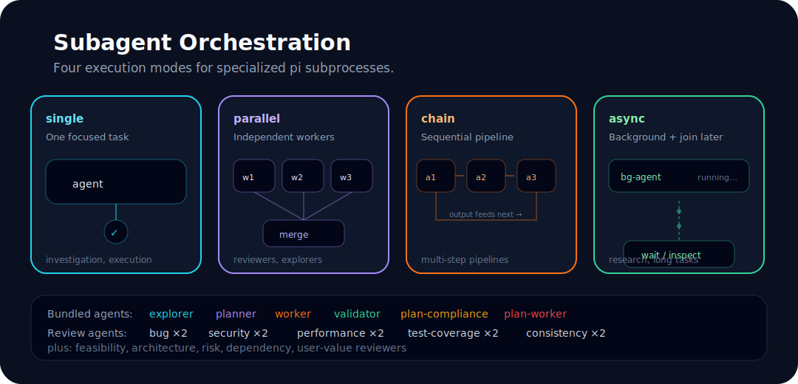
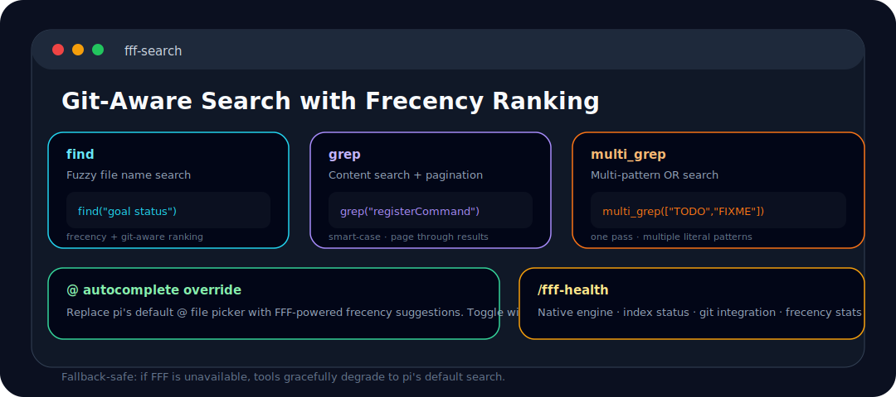
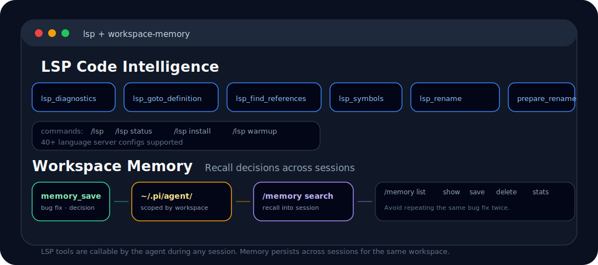

<p align="center">
  
</p>

<p align="center">
  
</p>

<p align="center">
  <strong>Engineering discipline, spec-first orchestration, and power-user tools for the <a href="https://pi.dev">pi</a> coding agent.</strong>
</p>

<p align="center">
  <a href="https://github.com/akillness/jeo-pi/releases"></a>
  <a href="https://github.com/akillness/jeo-pi/actions/workflows/ci.yml"></a>
  <a href="https://github.com/akillness/jeo-pi/actions/workflows/release.yml"></a>
  <a href="https://akillness.github.io/jeo-pi/"></a>
  <a href="package.json"></a>
  <a href="https://github.com/earendil-works/pi"></a>
  <a href="https://www.typescriptlang.org"></a>
</p>

<p align="center">
  <strong>8</strong> bundled extensions · <strong>spec-*</strong> skill family · planner / architect / critic / executor agents · verifier-gated completion
</p>

---

> **jeo-pi** is an engineering-discipline extension suite for the **pi** coding agent. It began as a fork of
> [tmdgusya/roach-pi](https://github.com/tmdgusya/roach-pi) (MIT) and now reflects
> [jeo-code](https://github.com/akillness/jeo-code)'s spec-first **Ouroboros** workflow —
> _deep-interview → deep-dive → ralplan → team → ultragoal_ — directly into pi's native extension
> machinery instead of bolting on a parallel framework. See [`docs/jeo-pi/spec-stack.md`](docs/jeo-pi/spec-stack.md).

## Table of Contents

- [What is jeo-pi?](#what-is-jeo-pi)
- [The spec-first loop](#the-spec-first-loop)
- [Eight extensions, one loop](#eight-extensions-one-loop)
- [Installation](#installation)
- [Quick Start](#quick-start)
- [spec-\* skill family](#the-spec--skill-family)
- [Clarify, then goal](#clarify-then-goal)
- [Delegate in parallel](#delegate-in-parallel)
- [Review](#catch-it-before-it-ships)
- [FFF Search](#search-git-aware)
- [LSP Code Intelligence](#lsp-code-intelligence)
- [MCP Adapter](#mcp-adapter)
- [Workspace Memory](#memory-that-recalls)
- [Session Loop](#loops-that-self-clean)
- [Nested AGENTS.md](#nested-agentsmd)
- [Code Previews](#previews-that-highlight)
- [Commands Reference](#commands-reference)
- [Tools Reference](#tools-reference)
- [Configuration](#configuration)
- [Repository Layout](#repository-layout)
- [Development](#development)
- [Contributing](#contributing)
- [License](#license)

---

## What is _jeo-pi_?

jeo-pi turns an ordinary pi session into a disciplined engineering loop: ambiguity is forced into the open
before code is written, plans are reviewed by adversarial role agents, execution is delegated to bounded
subagents, and **completion is gated by a verifier** — a target cannot be marked done until the verifier
returns `PASS`.

It is intentionally inspectable: every command, tool, hook, agent, and skill is plain TypeScript and Markdown
in this repository. Nothing is hidden behind an opaque service.

---

## The spec-first loop

jeo-pi reflects jeo-code's **Ouroboros** workflow into roach-pi's agentic-harness rather than reimplementing it.
The contract is frozen as an **immutable seed**, executed against, evaluated honestly, and re-seeded when reality drifts.

<p align="center">
  
</p>

| Stage | What happens | Driven by |
|---|---|---|
| **Interview** | Route ambiguous work through `/clarify`; freeze nothing until ambiguity ≤ 0.2 | `spec-stack` · `/clarify` |
| **Seed** | `spec-stack` freezes the Goal Contract under `.ouroboros/seeds/*.yaml` in your workspace (immutable; revisions create new entries) | `spec-stack` |
| **Execute** | Drive with `/goal`; delegate bounded slices to role subagents | `spec-execute` · `/goal` · `executor` |
| **Evaluate** | Never claim done until the verifier returns `PASS`; attach evidence; never weaken criteria | `spec-verify` · `reviewer-verifier` |
| **Evolve** | Compare outcome to seed, record drift, re-seed | `spec-stack` · `spec-verify` |

---

## Eight extensions, _one loop_.

Eight bundled extensions cooperate around the agentic-harness core:

<p align="center">
  
</p>

| Extension | Responsibility |
|---|---|
| **agentic-harness** | Workflow runtime (`/clarify`, `/goal`), `subagent`, `/review`, `team`, `webfetch`, the `spec-*` skills, and role agents |
| **fff-search** | Git-aware fuzzy `find` / `grep` / `multi_grep` and `@` autocomplete |
| **pi-lsp-client** | IDE-grade diagnostics, definitions, references, symbols, rename — 40+ language servers |
| **pi-mcp-adapter** | Lazy MCP proxy — discover and call MCP tools without burning the context window |
| **workspace-memory** | Save and recall structured findings, scoped per workspace |
| **session-loop** | Schedule recurring, self-cleaning prompts inside a session |
| **nested-agents-md** | Inject nearby `AGENTS.md` conventions when reading files |
| **pi-code-previews** | Syntax-highlighted previews for tool calls (powered by [shiki](https://shiki.style)) |

---

## Installation

jeo-pi is a **pi package** layered on top of the [`pi`](https://pi.dev) coding agent — now maintained
at [earendil-works/pi](https://github.com/earendil-works/pi) and published to npm as
[`@earendil-works/pi-coding-agent`](https://www.npmjs.com/package/@earendil-works/pi-coding-agent).
You do **not** need to clone, install, or configure
[roach-pi](https://github.com/tmdgusya/roach-pi): jeo-pi began as a fork but ships its own bundled
extensions, agents, skills, **JEO PI** banner, and `/setup` flow.

**Prerequisites:** Node.js `>= 22.19.0` (or Bun `>= 1.3` to build jeo-pi from source) and a terminal.

### 1. Install pi

```bash
# npm (recommended)
npm install -g --ignore-scripts @earendil-works/pi-coding-agent

# …or the official installer
curl -fsSL https://pi.dev/install.sh | sh
```

`--ignore-scripts` is intentional — pi needs no dependency lifecycle scripts for a normal install.
Then confirm the CLI is on your `PATH`:

```bash
pi --version            # 0.80.x or newer
```

### 2. Authenticate a model provider

Pick one. Use a subscription via `/login`:

```bash
pi
/login                  # then select Anthropic / Antigravity / OpenAI / Copilot / …
```

…or export an API key before launching:

```bash
export ANTHROPIC_API_KEY=sk-ant-...   # or OPENAI_API_KEY, GEMINI_API_KEY, …
pi
```

> **Branded sign-in (Anthropic & Antigravity).** After the OAuth handshake, the
> browser callback renders pi's own **인증 브라우저** confirmation page (the pi
> logo with a success / error state) instead of a raw redirect, then hands the
> token back to the terminal. Both subscription providers share the same page.
>
> **Antigravity Claude.** jeo-pi offers only the Antigravity Claude ids that are
> live-routable through Cloud Code Assist: `antigravity/claude-sonnet-4-6` and
> `antigravity/claude-opus-4-6-thinking`. These were verified with the real `pi`
> CLI path; broader static aliases from `jeo-code` are intentionally hidden when
> CCA returns HTTP 400/404 for them.
>
> **Anthropic subscription vs. extra usage.** When a Claude Pro/Max OAuth login
> hits Anthropic's "Third-party apps now draw from your extra usage, not your
> plan limits" response, jeo-pi surfaces an actionable error (add extra usage at
> `claude.ai/settings/usage`, or `/login → Use an API key` with an `sk-ant-api…`
> key) instead of the raw HTTP 400. The Anthropic provider also retries once with
> plain budget thinking when a model rejects the `effort` parameter (Sonnet/Haiku
> 4.5), and once with thinking artifacts stripped on a rejected replay.

### 3. Install jeo-pi

```bash
# From GitHub (recommended)
pi install git:github.com/akillness/jeo-pi

# …pin to a tag or commit
pi install git:github.com/akillness/jeo-pi@v1.19.0
```

<details><summary>Install from a local checkout (for development)</summary>

```bash
git clone https://github.com/akillness/jeo-pi.git
cd jeo-pi
npm install             # or: bun install
pi install .            # register this checkout as a user pi package
pi install . -l         # …or project-local (.pi/settings.json)
```
</details>

> [!WARNING]
> **Do not register both the git package and a local checkout at once.** If you
> ran `pi install .` (or `pi install . -l`) for development *and* `pi install
> git:github.com/akillness/jeo-pi`, pi loads the same extensions twice and aborts
> at startup with a wall of `Tool "…" conflicts with …` / `Flag "…" conflicts
> with …` errors (then `Hint: Start without extensions using "pi -ne"`). pi
> dedupes packages by canonical path, so it cannot tell the two copies are the
> same repo. Keep exactly one source registered — run `pi list`, then drop the
> extra with `pi remove .` (to use the git package) or `pi remove
> git:github.com/akillness/jeo-pi` (to keep developing from your checkout).

Confirm the package registered:

```bash
pi list                 # lists: git:github.com/akillness/jeo-pi
```

### 4. Run setup once

Restart `pi`, then:

```bash
/setup
```

`/setup` writes `quietStartup: true` to `~/.pi/agent/settings.json` so jeo-pi can own the **JEO PI**
startup banner instead of duplicating pi's default extension listing. It can also offer to star
[`akillness/jeo-pi`](https://github.com/akillness/jeo-pi) — never roach-pi.

### Update / remove

```bash
pi update git:github.com/akillness/jeo-pi   # update jeo-pi to the latest commit
pi update --all                             # update pi and every installed package
pi remove git:github.com/akillness/jeo-pi   # uninstall jeo-pi
```

> [!WARNING]
> If you have the `superpowers` skill installed, remove it before using jeo-pi. It can define skill names that collide with jeo-pi's bundled `spec-*` and `agentic-*` skills, and pi does not guarantee extension override order for duplicate skills.

---

## Quick Start

From a fuzzy idea to a verified implementation:

```text
/clarify Add a feature that exports review results as Markdown
```

After the Goal Contract is clear, run durable execution:

```text
/goal
```

The runtime creates/activates the goal, drives implementation, records evidence, requests verifier-guarded completion, and **continues after a verifier FAIL until PASS**. Use `/goal status` to inspect state without starting work.

Before merging non-trivial changes, run a review:

```text
/review
```

Quick system checks:

```text
/fff-health
/lsp status
/memory stats
```

---

## The `spec-*` skill family

jeo-pi ships jeo-code's full spec-first workflow as a five-skill family under `extensions/agentic-harness/skills/`:

| Skill | Reflects (jeo-code) | Purpose |
|---|---|---|
| `spec-stack` | `deep-interview` | End-to-end loop and ambiguity gate (incl. `--auto` non-interactive clarification) |
| `spec-deep-dive` | `deep-dive` | Root-cause investigation before requirements, for defects with an unknown cause |
| `spec-blueprint` | `ralplan` | Planner / Architect / Critic planning that preserves contested decisions |
| `spec-execute` | `team` | Per-task executor loop against the plan |
| `spec-verify` | `ultragoal` | Evidence-backed acceptance-criteria verification |

These are backed by read-only **planner / architect / critic** role agents and a write-capable **executor** agent in
`extensions/agentic-harness/agents/`, plus the bundled `agentic-*` reasoning skills (brainstorming, clarification,
goal, simplify, systematic-debugging, and the Karpathy / Rob-Pike style guides).

---

## Clarify, then _goal_.

Vague requests should not become vague code.

**`/clarify`** forces ambiguity into the open before implementation starts. It asks one focused question, offers concrete choices when useful, and explores relevant files with an `explorer` subagent in parallel. The output is a **Goal Contract** — objective, scope, constraints, success criteria, evidence required, risks, and suggested initial subgoals.

**`/goal`** owns durable execution. It tracks queued goals, active subgoals, evidence, blockers, verifier receipts, and automatic continuation. Completion is guarded by `reviewer-verifier`; a target cannot complete until the verifier returns PASS.

| Command | Purpose |
|---|---|
| `/clarify [topic]` | Resolve ambiguity with dynamic questions and parallel exploration |
| `/goal` | Auto-start or continue the durable goal runtime until verifier PASS |
| `/goal status` | Inspect active goal, subgoals, blockers, evidence, and next action |
| `/goal complete <targetId>` | Advanced: request verifier-guarded completion manually |
| `/reset-phase` | Clear active workflow phase |

---

## Delegate, in _parallel_.

The `subagent` tool delegates work to specialized agents running as separate `pi` processes.

<p align="center">
  
</p>

| Mode | Use it for |
|---|---|
| **Single** | One focused investigation or execution task |
| **Parallel** | Independent reviewers, explorers, or workers |
| **Chain** | Sequential pipelines where each step consumes the previous output |
| **Async** | Background tasks that can be waited on, checked, or interrupted by run id |

Async subagents support `asyncDependency: "needed-before-final"` when the lead agent must join results before finalizing its response.

---

## Catch it, _before it ships_.

**`/review`** — a quick, integrated single-pass review of a PR, branch, or local diff. It resolves the target (PR number, PR URL, branch name, or an auto-detected local diff), then streams findings across bugs, security, performance, test coverage, and consistency directly to chat. No subagents, no saved file — just fast feedback.

| Command | Description |
|---|---|
| `/review [target]` | Quick single-pass review. Target can be omitted, PR number, PR URL, or branch |

---

## Search, _git-aware_.

The bundled FFF extension upgrades pi's file and content search with git-aware ranking and frecency.

<p align="center">
  
</p>

- **`find`** — fuzzy file-name search with frecency and git-aware ranking
- **`grep`** — content search with pagination and smart-case behavior
- **`multi_grep`** — multi-pattern OR search in one pass
- **`@` autocomplete** — replace pi's default file picker with FFF suggestions (toggle with `/fff-mode both`)

FFF is fallback-safe: if the native engine is unavailable, tools gracefully degrade to pi's default search.

---

## LSP Code Intelligence

The bundled `pi-lsp-client` extension adds IDE-like operations directly inside pi sessions:

- `lsp_diagnostics` — errors, warnings, and hints
- `lsp_goto_definition` — jump to symbol definitions
- `lsp_find_references` — find all usages across the workspace
- `lsp_symbols` — document and workspace symbol search
- `lsp_prepare_rename` — check if a rename is safe
- `lsp_rename` — rename a symbol across the entire workspace

Supports **40+ language server configs** out of the box.

```text
/lsp              Open the LSP server inspector
/lsp status       Print installed/available language server summary
/lsp install <id> Run a whitelisted install recipe
/lsp warmup <id>  Preload a language server for the workspace
```

---

## MCP Adapter

The bundled [pi-mcp-adapter](https://github.com/nicobailon/pi-mcp-adapter) extension gives pi access to MCP (Model Context Protocol) servers without burning the context window. Instead of registering hundreds of tool definitions upfront, a single proxy tool (~200 tokens) discovers and calls MCP tools on-demand.

```text
mcp({ search: "screenshot" })              # discover tools by keyword
mcp({ tool: "chrome_devtools_take_screenshot", args: '{"format": "png"}' })  # call a tool
```

Servers are **lazy by default** — they only connect when you use their tools, and disconnect after idle timeout. Specific tools can be promoted to first-class pi tools via `directTools` config.

| Command | Description |
|---|---|
| `/mcp` | Interactive server panel with connection status and tool toggles |
| `/mcp setup` | Guided first-run setup (import existing configs, scaffold `.mcp.json`) |
| `/mcp tools` | List all available MCP tools |
| `/mcp reconnect [server]` | Connect or reconnect a server |
| `/mcp logout <server>` | Clear stored OAuth credentials |
| `/mcp-auth [server]` | OAuth authentication flow |

Configuration reads standard MCP files automatically: `~/.config/mcp/mcp.json`, `.mcp.json`, or pi-specific overrides in `~/.pi/agent/mcp.json`.

---

## Memory that _recalls_.

<p align="center">
  
</p>

Workspace memory stores important findings as structured records under pi's agent directory, scoped by workspace. It recalls relevant records into future sessions automatically.

Each saved memory is additionally mirrored into a human-, git-, and graphify-readable **OKF (Open Knowledge Format) v0.1** knowledge bundle at `.jeo/memory/` — one concept document per memory, plus a progressive-disclosure `index.md` and an ISO-8601 `log.md`. The JSON store stays the operational source of truth; the bundle is an additive, durable knowledge layer. Set `JEO_NO_MEMORY=1` to disable persistence and the mirror entirely.

Recall is keyword-ranked over the lightweight index, then — when injection slots remain — expanded one hop along the bundle's concept cross-link graph, so a memory the query directly hits can pull in the neighbours it links to. The expansion is dormant until memories cross-link and never crowds out a lexical hit.

```text
/memory list             List all memories
/memory show <id>        Show a specific memory
/memory save <text>      Save a new memory
/memory delete <id>      Delete a memory
/memory search <query>   Search memories
/memory stats            Show memory statistics
/memory okf [lint|rebuild]  Lint or rebuild the OKF knowledge bundle
```

The LLM-callable `memory_save` tool is used after bug fixes, decisions, or useful discoveries — so the agent avoids repeating the same fixes.

---

## Loops that _self-clean_.

**`/loop`** schedules recurring prompts inside the current session — useful for health checks, monitoring, or continuous verification:

```text
/loop 5m check git status and report changes
/loop 30s verify the dev server is running on port 3000
```

Jobs are session-scoped, error-isolated, timeout-protected, and cleaned up on shutdown.

```text
/loop-list           List active loop jobs
/loop-stop [job-id]  Stop one loop job
/loop-stop-all       Stop all loop jobs
```

---

## Nested `AGENTS.md`

The bundled nested-agents extension injects nearby directory-level `AGENTS.md` files whenever the agent reads a file. This lets each subtree carry local conventions without forcing you to paste them into every prompt.

```text
/nested-agents           Toggle the nested AGENTS.md context widget
pi --no-nested-agents    Disable at startup
```

---

## Previews that _highlight_.

The bundled `pi-code-previews` extension renders syntax-highlighted previews for pi tool calls, so code and diffs in tool output read like an editor instead of plain text. Highlighting is powered by [shiki](https://shiki.style).

---

## Commands Reference

### Workflow

| Command | Description |
|---|---|
| `/clarify [topic]` | Resolve ambiguity with dynamic questions and parallel exploration |
| `/goal` | Auto-start or continue durable goal execution until verifier PASS |
| `/goal status` | Inspect durable goal runtime status |
| `/goal complete <targetId>` | Advanced: request verifier-guarded completion manually |
| `/reset-phase` | Clear active clarify/goal state |

### Review

| Command | Description |
|---|---|
| `/review [target]` | Quick single-pass review (omit target, PR number, URL, or branch) |

### Search, LSP, Memory

| Command | Description |
|---|---|
| `/fff-mode both\|tools-only` | Toggle FFF powering both tools and `@` autocomplete or tools only |
| `/fff-health` | Show FFF engine, index, git, and frecency status |
| `/fff-rescan` | Trigger an explicit FFF rescan |
| `/lsp` | Open the LSP server inspector |
| `/lsp status` | Print installed/available language server summary |
| `/lsp install <serverId>` | Run a whitelisted install recipe or show a manual hint |
| `/lsp warmup <serverId>` | Preload a language server for the workspace |
| `/memory ...` | Manage workspace memories (list, show, save, delete, search, stats) |
| `/loop <interval> <prompt>` | Schedule recurring prompts |
| `/loop-list` | List active loop jobs |
| `/loop-stop [job-id]` | Stop one loop job |
| `/loop-stop-all` | Stop all loop jobs |

### MCP

| Command | Description |
|---|---|
| `/mcp` | Interactive MCP server panel |
| `/mcp setup` | Guided first-run setup |
| `/mcp tools` | List all MCP tools |
| `/mcp reconnect [server]` | Connect or reconnect a server |
| `/mcp logout <server>` | Clear stored OAuth credentials |
| `/mcp-auth [server]` | OAuth authentication flow |

### Setup and Experimental

| Command | Description |
|---|---|
| `/setup` / `/init` | Configure recommended settings (`quietStartup: true`) |
| `/team ...` | Optional bounded team runner (requires `PI_ENABLE_TEAM_MODE=1`) |
| `/nested-agents` | Toggle nested `AGENTS.md` context widget |
| `/ask` | Manual smoke test for `ask_user_question` |

### TUI conveniences

| Command | Description |
|---|---|
| `/scrollback` | Open a scrollable, keyboard-driven view of the conversation history (default `alt+s`) |
| `/copy` | Copy the conversation transcript to the clipboard (`/copy last` = last reply only; default `alt+c`) |
| `$<skill> [args]` | Invoke a bundled or installed skill by its `$` shorthand — equivalent to `/skill:<skill>` (e.g. `$research`, `$dspy`). Only rewrites when the skill exists; `$$` is a literal escape, so a leading `$` can still be typed |

> Skill text in the TUI is intentionally de-emphasized: the startup `[Skills]` panel and `[Skill conflicts]` notice render in a neutral (dim) tone instead of yellow, so skill listings no longer stand out. Skill **discovery** still autocompletes via `/skill:`; the `$` shorthand is for **invocation** at submit time.

---

## Tools Reference

| Tool | What it does |
|---|---|
| `ask_user_question` | Focused multiple-choice or free-text clarification questions |
| `subagent` | Specialized agents in single, parallel, chain, or async modes |
| `webfetch` | Fetch web pages and convert to Markdown with caching |
| `bash` | Sandboxed shell execution with optional approval policy |
| `find` | FFF-backed fuzzy file search |
| `grep` | FFF-backed content search with pagination |
| `multi_grep` | Multi-pattern OR content search |
| `memory_save` | Save structured workspace memories |
| `team` | Optional team orchestration (gated by `PI_ENABLE_TEAM_MODE=1`) |
| `lsp_*` | Diagnostics, definitions, references, symbols, and rename |
| `mcp` | MCP proxy — search, describe, and call MCP server tools |

---

## Configuration

### Recommended Startup

```jsonc
// ~/.pi/agent/settings.json
{
  "quietStartup": true
}
```

`/setup` writes this for you.

### FFF Search Mode

```bash
PI_FFF_MODE=both pi          # tools + @ autocomplete
PI_FFF_MODE=tools-only pi    # tools only
```

Or change it live:

```text
/fff-mode both
/fff-mode tools-only
```

### Team Mode

```bash
PI_ENABLE_TEAM_MODE=1 pi
```

Disabled by default. Exposes the `team` tool and makes `/team` functional.

### Sandboxed Bash Approval

```bash
PI_SANDBOX_APPROVAL_MODE=ask pi      # ask before escalation
PI_SANDBOX_APPROVAL_MODE=always pi   # approve automatically
PI_SANDBOX_APPROVAL_MODE=deny pi     # block escalation
```

### LSP Configuration

Create project-local `.pi/lsp-client.json` or user-global `~/.pi/lsp-client.json`:

```jsonc
{
  "lsp": {
    "my-server": {
      "command": ["my-lsp", "--stdio"],
      "extensions": [".myext"]
    }
  }
}
```

---

## Repository Layout

```text
extensions/
  agentic-harness/     # workflow runtime, subagents, review, team, webfetch
    skills/            # spec-* family + agentic-* reasoning skills
    agents/            # planner / architect / critic / executor role agents
  fff-search/          # FFF-backed find/grep/multi_grep and @ autocomplete
  session-loop/        # recurring session prompts
  workspace-memory/    # save/recall workspace memory
  pi-mcp-adapter/      # lazy MCP proxy
  pi-code-previews/    # syntax-highlighted tool-call previews (shiki)
  pi-scrollback/       # scroll conversation history + copy transcript (TUI)
docs/jeo-pi/           # spec-stack mapping and design notes
docs/engineering-discipline/
  context/ plans/ reviews/   # Context Briefs, plans, review outputs
assets/                # README visuals (SVG graphs + mascot)
```

Bundled package dependencies also include `pi-lsp-client`, `pi-mcp-adapter`, `@code-yeongyu/pi-nested-agents-md`, and `shiki` (powering `pi-code-previews`).

At runtime, `spec-stack` writes frozen seeds to `.ouroboros/seeds/` in your working directory and the harness persists goal-run state under `.pi/agent/goal-state/`; neither is tracked in this repository.

---

## Development

Run the workspace test suite and type check from the repo root:

```bash
npm test          # vitest run extensions/
npm run typecheck # tsc -p extensions/agentic-harness/tsconfig.json --noEmit
```

To build/check a single extension, use the per-extension scripts:

```bash
npm --prefix extensions/agentic-harness install
npm --prefix extensions/agentic-harness test
npm --prefix extensions/agentic-harness run build
```

`pi-code-previews` exposes `check` (typecheck + lint + format) instead of `build`; the rest expose `build` (`tsc --noEmit`).

---

## Changelog

The five most recent releases are shown below; see [`CHANGELOG.md`](CHANGELOG.md) for the full history.

<!-- CHANGELOG:START -->
<!-- Generated by scripts/sync-readme-changelog.mjs — do not edit by hand; run `npm run changelog:sync`. -->

### [1.27.0](https://github.com/akillness/jeo-pi/compare/v1.26.5...v1.27.0) (2026-06-30)

#### Features

* **agentic-harness:** /autopilot autonomous build loop with ratchet brain ([1b115b1](https://github.com/akillness/jeo-pi/commit/1b115b16cdba314544f268f2d4fdd1716a3a8d40))
* **workspace-memory:** RRF recall fusion + session-end distillation ([372928d](https://github.com/akillness/jeo-pi/commit/372928dde341f1b2d69bea97dcdf4a768cd341ef))

#### Documentation

* **pi-mcp-adapter:** record MCP client-vs-server scope decision ([3e3f308](https://github.com/akillness/jeo-pi/commit/3e3f30830d5f5bdf400b1e74462227a42f31207f))

### [1.26.5](https://github.com/akillness/jeo-pi/compare/v1.26.4...v1.26.5) (2026-06-30)

#### Bug Fixes

* **provider-auth:** close the bare tool_use 400 for thinking-enabled Claude ([9832eff](https://github.com/akillness/jeo-pi/commit/9832eff97c446c7c28517603f91eaec97a1b257a))

### [1.26.4](https://github.com/akillness/jeo-pi/compare/v1.26.3...v1.26.4) (2026-06-30)

#### Bug Fixes

* **provider-auth:** port jeo-code's deprecated-temperature 400 fail-safe for Claude ([4e67749](https://github.com/akillness/jeo-pi/commit/4e67749afd19a9d08f7fb598be195c046804ee0b))

### [1.26.3](https://github.com/akillness/jeo-pi/compare/v1.26.2...v1.26.3) (2026-06-30)

#### Bug Fixes

* **provider-auth:** host-gate Claude OAuth shape so Tencent shares the transport safely ([78ce88a](https://github.com/akillness/jeo-pi/commit/78ce88ae2794b2d1d5cfd052be6a7fbf22e34364))

### [1.26.2](https://github.com/akillness/jeo-pi/compare/v1.26.1...v1.26.2) (2026-06-30)

#### Bug Fixes

* **provider-auth:** send bare TokenHub model id over the wire ([d782f27](https://github.com/akillness/jeo-pi/commit/d782f278aac0eb779df4d507c8a75d4e0ac431dc))

_See [`CHANGELOG.md`](CHANGELOG.md) for the complete release history._
<!-- CHANGELOG:END -->

---

## Contributing

See [CONTRIBUTING.md](CONTRIBUTING.md). For larger changes, prefer the same discipline jeo-pi enforces: clarify the goal, freeze a seed, write a plan, implement in small steps, and verify with tests or a focused manual check before claiming done.

---

## License

MIT — see [package.json](package.json). jeo-pi is a fork of [roach-pi](https://github.com/tmdgusya/roach-pi) (MIT) and reflects workflows from [jeo-code](https://github.com/akillness/jeo-code).
